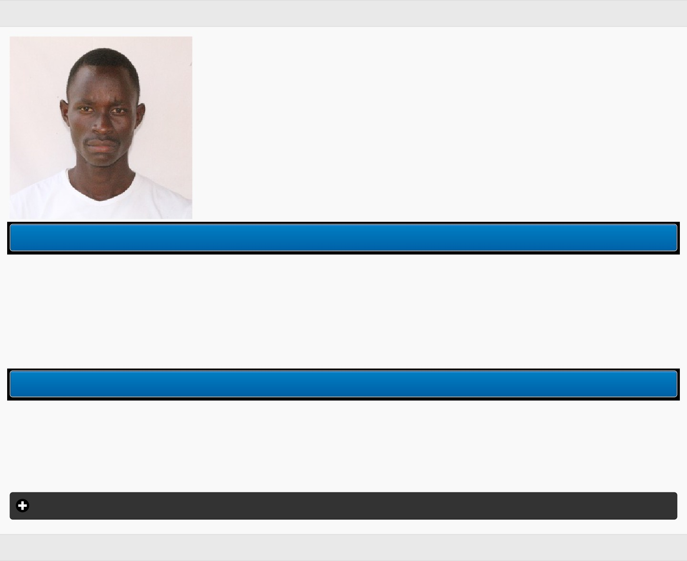

<html>
<head><meta http-equiv=Content-Type content="text/html; charset=UTF-8">

</head>
<body>

Kyambogo University

ORIOKOT PIUS

STD NO.

1800813927

REG NO.

18/U/SSD/13927/PD

ACC YR.

2018/2019

STUDY YR.

1

SEM

1

PROV.

false

EXP.

null

REG BY.

MRS. KACOOBOYE ROSEMARY EKOL

A/C BAL.

UGX. 0

COURSE UNITS

(APY1102) HUMAN GROWTH AND DEVELOPMENT

normal

(ASA1101) FOUNDATIONS OF SOCIAL ADMINISTRATION

normal

(BS1101) COMMUNICATION SKILLS I

normal

(ASA1102) CURRENT DEVELOPMENT PROBLEMS

normal

(APY1101) GENERAL PSYCHOLOGY

normal

(ASO1102) SOCIAL ANTHROPOLOGY

normal

(ASO1101) FOUNDATIONS OF SOCIOLOGY

normal

Student Details

© Zeenode Uganda Ltd

</body>
</html>
